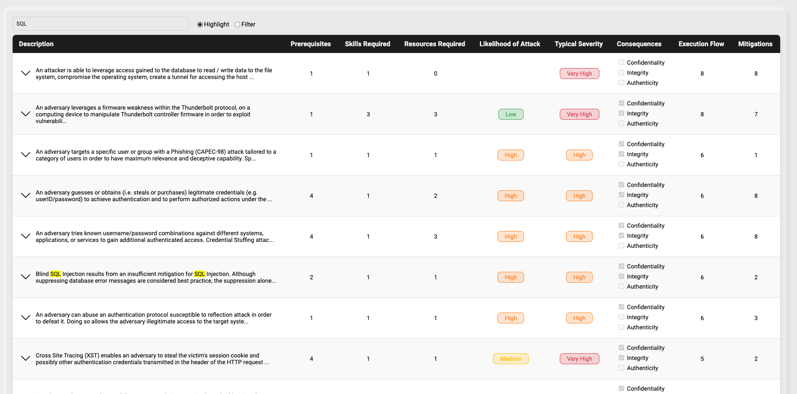

# CYMETRIS - Frontend Assessment Task

This project involves the development of a cybersecurity risk assessment tool designed specifically for automotive systems. The tool focuses on presenting and analyzing Common Attack Pattern Enumeration and Classification (CAPEC) attack patterns relevant to vehicle cybersecurity. Demo hosted at [Github Pages](https://barantoro.github.io/capec-list/)

## Table of contents

-   [Overview](#overview)
    -   [The challenge](#the-challenge)
    -   [Screenshot](#screenshot)
-   [Getting Started](#getting-started)
    -   [Setup](#setup)
    -   [Development Server](#development-server)
    -   [Production](#production)
-   [Components](#components)
    -   [Chips Badge](#chips-badge)
    -   [Edit Modal](#edit-modal)
    -   [Search Bar](#search-bar)
    -   [Custom Table](#custom-table)
    -   [Table Header](#table-header)
    -   [Table Row](#table-row)
    -   [Description Cell](#description-cell)
    -   [Consequences Cell](#consequences-cell)
    -   [Expand Row](#expand-row)
    -   [Expand Row Item](#expand-row-item)
-   [Composables](#composables)
    -   [useAttackPatterns](#use-attack-patterns)
    -   [useEditModal](#use-edit-modal)
-   [Testing](#testing)
    -   [EditModal](#edit-modal-spec)
    -   [TableRow](#table-row-spec)
    -   [GeneralTestingTips](#general-testing-tips)
-   [Notes](#notes)

## Overview

### The Challenge

Main objective is to create a performant and minimally interactive interface that can seamlessly read in and display CAPEC attack patterns. The pattern descriptions can then be searched for via an input field.

#### Tasks

-   **JSON Data Parsing:** Read in a provided JSON file containing CAPEC attack patterns.
-   **Dynamic Dynamic Table Creation:** Design a performant table that displays the attack patterns. They should be sorted by the number of associated attack steps (see “Execution_Flow”). Every attack pattern should display all data given in the AttackPattern interface in an easy to read manner. For “Consequence scope” items only display checkboxes for Confidentiality, Integrity, and Authenticity. You can ignore other consequences. Double clicking the attack pattern description should allow the user to change it. A search bar should allow the user to filter the list by description text. Based on a toggle the search should either be highlighted in the pattern descriptions or filter the list..
-   **Components:** Use TypeScript and Vue to create the necessary components. Do not use a UI kit.
-   **Styling:** Implement basic styling using a system of your choice.
-   **Component Management:** Use Storybook to manage and present your components, showcasing each component's functionality and variants.
-   **Testing:** Implement tests for your components using your preferred testing suite. Validate functionality, interactivity, and performance.

#### Stack Requirement

-   Vue 3
-   Typescript

### Screenshot

<p align="center">
  
</p>

## Getting Started

To get started with the project, follow the instructions below:

### Installation

Clone the repository:

```bash
git clone https://github.com/barantoro/capec-list
cd capec-list
```

### Setup

Make sure to install the dependencies:

```bash
# npm
npm install

# yarn
yarn install
```

### Development Server

```bash
# npm
npm run dev

# yarn
yarn dev

```

Check out the [deployment documentation](https://nuxt.com/docs/getting-started/deployment) for more information.

## Components

### Chips Badge

The `ChipsBadge` component displays a text value with a background color indicating the level of risk. The background color changes based on the risk level specified.

### Props

| Prop    | Type   | Default | Description                                                |
| ------- | ------ | ------- | ---------------------------------------------------------- |
| `value` | String | `''`    | The risk level value that determines the background color. |

### CSS Classes

The component uses the following CSS classes for background color:

-   **background-low-risk** - Applied when value is 'Low'.
-   **background-medium-risk** - Applied when value is 'Medium'.
-   **background-high-risk** - Applied when value is 'High'.
-   **background-very-high-risk** - Applied when value is 'Very High'.
-   **background-transparent** - Applied for any other values or if no value is provided.

### Example Usage

```vue
<template>
	<ChipsBadge value="High" />
</template>

<script setup>
import ChipsBadge from "./ChipsBadge.vue";
</script>
```

### Edit Modal

The `EditModal` component provides a modal interface for editing content. It supports dynamic form fields based on the `content` prop and includes actions for saving or closing the modal.

### Props

| Prop      | Type   | Default | Description                                   |
| --------- | ------ | ------- | --------------------------------------------- |
| `content` | Object | `{}`    | An object representing the initial form data. |

### Events

| Event    | Description                                                                                        |
| -------- | -------------------------------------------------------------------------------------------------- |
| `save`   | Emitted when the user clicks "Save Changes", passing the form data.                                |
| `cancel` | Emitted when the user clicks "Close Modal" or the backdrop, indicating the modal should be closed. |

### Example Usage

```vue
<template>
	<EditModal :content="initialContent" @save="handleSave" @cancel="handleCancel" />
</template>

<script setup>
import { ref } from "vue";
import EditModal from "./EditModal.vue";

const initialContent = ref({
	title: "Initial Title",
	description: "Initial description here...",
});

const handleSave = (data) => {
	console.log("Saved data:", data);
};

const handleCancel = () => {
	console.log("Modal closed");
};
</script>
```

### Search Bar

The `SearchBar` component provides an interface for searching and selecting search modes. It includes a search input and radio buttons to toggle between different search modes.

### Props

| Prop          | Type   | Default | Description                                                    |
| ------------- | ------ | ------- | -------------------------------------------------------------- |
| `searchQuery` | String | `''`    | The current search query used for filtering or highlighting.   |
| `searchMode`  | String | `''`    | The current search mode, which can be 'highlight' or 'filter'. |

### Events

| Event                | Description                            |
| -------------------- | -------------------------------------- |
| `update:searchQuery` | Emitted when the search query changes. |
| `update:searchMode`  | Emitted when the search mode changes.  |

### Example Usage

```vue
<template>
	<SearchBar :searchQuery="searchQuery" :searchMode="searchMode" @update:searchQuery="handleSearchQueryUpdate" @update:searchMode="handleSearchModeUpdate" />
</template>

<script setup>
import { ref } from "vue";
import SearchBar from "./SearchBar.vue";

const searchQuery = ref("");
const searchMode = ref("highlight");

const handleSearchQueryUpdate = (query) => {
	searchQuery.value = query;
};

const handleSearchModeUpdate = (mode) => {
	searchMode.value = mode;
};
</script>
```

### Custom Table

The `CustomTable` component renders a table with headers and rows, incorporating functionalities to handle editing of row descriptions via a modal dialog. It utilizes subcomponents for table headers, rows, and the modal editor, and manages state for modal visibility and content.

### Props

| Prop           | Type   | Default | Description                                                             |
| -------------- | ------ | ------- | ----------------------------------------------------------------------- |
| `tableHeaders` | Array  | `[]`    | An array of strings representing the headers for the table columns.     |
| `items`        | Array  | `[]`    | An array of objects representing the rows to be displayed in the table. |
| `activeIndex`  | Number | `0`     | The index of the currently active (expanded) row in the table.          |
| `searchMode`   | String | `''`    | The current search mode, used for highlighting or filtering rows.       |
| `searchQuery`  | Array  | `''`    | The search query used for highlighting text within the table rows.      |

### Events

| Event             | Description                                                                    |
| ----------------- | ------------------------------------------------------------------------------ |
| `editDescription` | Emitted when a row's description is double-clicked, triggering the edit modal. |

### Notes

-   Ensure that the `TableHeader`, `TableRow`, and `EditModal` components are correctly implemented and imported into CustomTable.
-   The useEditModal composable should manage the state and actions related to the modal dialog.

### Example Usage

```vue
<template>
	<CustomTable :tableHeaders="headers" :items="dataItems" :searchMode="currentSearchMode" :searchQuery="currentSearchQuery" @editDescription="handleEditDescription" />
</template>

<script setup>
import { ref } from "vue";
import CustomTable from "./CustomTable.vue";

const headers = ref(["Description", "Prerequisites", "Skills Required"]);
const dataItems = ref([
	{
		Description: "Description for pattern 1",
		Prerequisites: ["Prerequisite 1"],
		Skills_Required: ["Skill 1"],
	},
	{
		Description: "Description for pattern 2",
		Prerequisites: ["Prerequisite 2"],
		Skills_Required: ["Skill 2"],
	},
]);
const currentSearchMode = ref("highlight");
const currentSearchQuery = ref("pattern");

const handleEditDescription = (pattern) => {
	console.log("Edit Description:", pattern);
};
</script>
```

### Table Header

The `TableHeader` component renders the header row of a table based on an array of header names. Each header is displayed in a `<th>` element within a `<thead>` section.

### Props

| Prop      | Type  | Default | Description                               |
| --------- | ----- | ------- | ----------------------------------------- |
| `headers` | Array | `[]`    | An array of header names to be displayed. |

### Example Usage

```vue
<template>
	<table>
		<TableHeader :headers="tableHeaders" />
		<!-- Table body and other elements here -->
	</table>
</template>

<script setup>
import TableHeader from "./TableHeader.vue";

const tableHeaders = ["Name", "Age", "Location"];
</script>
```

### Table Row

The `TableRow` component displays a single row in a table with interactive elements for expanding and collapsing the row to show additional details. It includes various columns for displaying information and supports conditional highlighting of descriptions based on a search query.

### Props

| Prop          | Type   | Default | Description                                                         |
| ------------- | ------ | ------- | ------------------------------------------------------------------- |
| `pattern`     | Object | `{}`    | The object containing the data to be displayed in the row.          |
| `index`       | Number | `0`     | The index of the row in the table.                                  |
| `activeIndex` | Number | `0`     | The index of the currently active row.                              |
| `searchMode`  | String | `''`    | The current search mode, which can affect description highlighting. |
| `searchQuery` | String | `''`    | The current search query used for highlighting.                     |

### Events

| Event             | Description                                                                 |
| ----------------- | --------------------------------------------------------------------------- |
| `editDescription` | Emitted when a description is double-clicked, passing the `pattern` object. |

### Example Usage

```vue
<template>
	<table>
		<tbody>
			<table-row :pattern="dataPattern" :index="rowIndex" :activeIndex="activeRowIndex" :searchMode="currentSearchMode" :searchQuery="currentSearchQuery" @editDescription="handleEditDescription" />
		</tbody>
	</table>
</template>

<script setup>
import { ref } from "vue";
import TableRow from "./TableRow.vue";

const dataPattern = ref({
	// Example pattern data
	Description: "This is a detailed description of the pattern.",
	Prerequisites: ["Prerequisite 1", "Prerequisite 2"],
	Skills_Required: ["Skill 1", "Skill 2"],
	Resources_Required: ["Resource 1"],
	Likelihood_Of_Attack: "High",
	Typical_Severity: "Medium",
	Consequences: [{ Scope: ["Confidentiality"] }],
	Execution_Flow: ["Step 1", "Step 2"],
	Mitigations: ["Mitigation 1"],
});
const rowIndex = ref(0);
const activeRowIndex = ref(0);
const currentSearchMode = ref("highlight");
const currentSearchQuery = ref("description");

const handleEditDescription = (pattern) => {
	console.log("Edit Description:", pattern);
};
</script>
```

### Description Cell

The `DescriptionCell` component displays a cell in a table row with a collapsible and expandable description. It includes functionality for highlighting search queries within the description text and emits events for expanding/collapsing the row and editing the description.

### Props

| Prop          | Type    | Default | Description                                                                  |
| ------------- | ------- | ------- | ---------------------------------------------------------------------------- |
| `expandRow`   | Boolean | `false` | Determines whether the row is expanded or collapsed.                         |
| `description` | String  | `''`    | The text content of the description to be displayed in the cell.             |
| `searchMode`  | String  | `''`    | The current search mode, used to control how the description is highlighted. |
| `searchQuery` | String  | `''`    | The search query used to highlight matching text in the description.         |

### Events

| Event              | Description                                                                      |
| ------------------ | -------------------------------------------------------------------------------- |
| `toggle`           | Emitted when the expand/collapse icon is clicked to toggle the expanded state.   |
| `edit-description` | Emitted when the description is double-clicked, indicating a request to edit it. |

### Example Usage

```vue
<template>
	<DescriptionCell :expandRow="isExpanded" :description="cellDescription" :searchMode="currentSearchMode" :searchQuery="currentSearchQuery" @toggle="handleToggle" @edit-description="handleEditDescription" />
</template>

<script setup>
import { ref } from "vue";
import DescriptionCell from "./DescriptionCell.vue";

const isExpanded = ref(false);
const cellDescription = ref("This is an example of a description that might be very long and require truncation or highlighting based on a search query.");
const currentSearchMode = ref("highlight");
const currentSearchQuery = ref("example");

const handleToggle = () => {
	isExpanded.value = !isExpanded.value;
};

const handleEditDescription = () => {
	console.log("Edit description triggered");
};
</script>
```

### Consequences Cell

The `ConsequencesCell` component displays a list of predefined consequence scopes with checkboxes indicating which scopes are present based on the provided consequences data. The checkboxes are disabled and only serve as indicators.

### Props

| Prop           | Type  | Default | Description                                                          |
| -------------- | ----- | ------- | -------------------------------------------------------------------- |
| `consequences` | Array | `[]`    | An array of consequence objects, each containing a `Scope` property. |

### Notes

-   The `scopes` array within the component defines the set of possible consequence scopes to display. This array can be adjusted as needed.

### Example Usage

```vue
<template>
	<ConsequencesCell :consequences="consequencesData" />
</template>

<script setup>
import ConsequencesCell from "./ConsequencesCell.vue";
import { ref } from "vue";

const consequencesData = ref([{ Scope: ["Confidentiality"] }, { Scope: ["Integrity", "Confidentiality"] }]);
</script>
```

### Expand Row

The `ExpandRow` component displays a detailed view of a row's data in a table, including a description and additional expandable items. It is used to show more detailed information for a specific row when expanded.

### Props

| Prop      | Type   | Default | Description                                         |
| --------- | ------ | ------- | --------------------------------------------------- |
| `pattern` | Object | `{}`    | The data object containing details to be displayed. |
| `colspan` | Number | `1`     | The number of columns the cell should span.         |

### Notes

-   Ensure that the `ExpandRowItem` component is correctly imported and used within the `ExpandRow` component.
-   The `isNonEmptyArray` function is used to check if a value is a non-empty array, which determines whether to render `ExpandRowItem` components. Adjust this logic based on the data structure and requirements.
-   The `colspan` prop should match the number of columns the expanded row should span in your table layout.

### Example Usage

```vue
<template>
	<ExpandRow :pattern="expandedPattern" :colspan="colspanCount" />
</template>

<script setup>
import ExpandRow from "./ExpandRow.vue";
import { ref } from "vue";

const expandedPattern = ref({
	Description: "Detailed description of the item.",
	Prerequisites: ["Prerequisite 1", "Prerequisite 2"],
	Skills_Required: ["Skill 1"],
	Resources_Required: ["Resource 1"],
});

const colspanCount = ref(4); // Adjust according to your table layout
</script>
```

### Expand Row Item

The `ExpandRowItem` component displays a section within an expanded row, showing a list of items under a specified title. It handles different types of data, including objects, arrays, and strings, and formats them accordingly for display.

### Props

| Prop    | Type                            | Default | Description                                   |
| ------- | ------------------------------- | ------- | --------------------------------------------- |
| `title` | String                          | `''`    | The title for the section being displayed.    |
| `items` | [Object, String, Number, Array] | `[]`    | The data to be displayed within this section. |

### Notes

-   The `formattedTitle` computed property converts underscores in the title to spaces for a cleaner display.
-   The `isObject` function checks if a value is an object to properly handle nested data structures.

### Example Usage

```vue
<template>
	<ExpandRowItem :title="'Skills_Required'" :items="skillsRequired" />
</template>

<script setup>
import ExpandRowItem from "./ExpandRowItem.vue";
import { ref } from "vue";

const skillsRequired = ref(["Skill 1", "Skill 2", { Advanced: ["Technique 1", "Technique 2"] }]);
</script>
```

## Composables

### useAttackPatterns

The `useAttackPatterns` composable provides functionality for managing and filtering a list of attack patterns. It includes sorting and filtering based on a search query and search mode.

### Parameters

| Parameter     | Type | Description                                                       |
| ------------- | ---- | ----------------------------------------------------------------- |
| `searchQuery` | Ref  | A reactive reference to the current search query.                 |
| `searchMode`  | Ref  | A reactive reference to the current search mode (e.g., 'filter'). |

### Returns

| Property   | Type                          | Description                                                              |
| ---------- | ----------------------------- | ------------------------------------------------------------------------ |
| `patterns` | Computed Ref<AttackPattern[]> | A computed reference to the filtered and sorted list of attack patterns. |

### Data Structure

The composable operates on the CAPEC_ATTACK_PATTERNS data which should adhere to the AttackPattern type, which includes:

-   **Description:** A string describing the attack pattern.
-   **Execution_Flow:** An array representing the steps involved in the execution flow.

### Dependencies

-   **CAPEC_ATTACK_PATTERNS:** The source data for attack patterns.
-   **AttackPattern:** The type definition for attack patterns.

### Example Usage

```typescript
import { ref } from "vue";
import { useAttackPatterns } from "./Composables/useAttackPatterns";

const searchQuery = ref("example");
const searchMode = ref("filter");

const { patterns } = useAttackPatterns(searchQuery, searchMode);

patterns.value.forEach((pattern) => {
	console.log(pattern.Description);
});
```

### useEditModal

The `useEditModal` composable provides functionality for managing the state of an edit modal. It includes methods for opening, saving, and canceling the modal, along with managing its content.

### Returns

| Property           | Type         | Description                                                            |
| ------------------ | ------------ | ---------------------------------------------------------------------- |
| `showEditModal`    | Ref<boolean> | A reactive reference indicating whether the modal is visible.          |
| `editModalContent` | Ref<Object>  | A reactive reference to the content to be edited in the modal.         |
| `openModal`        | Function     | A function to open the modal and set its content.                      |
| `handleSave`       | Function     | A function to handle saving the updated content and closing the modal. |
| `handleCancel`     | Function     | A function to handle canceling the modal and clearing its content.     |

### Methods

-   **openModal(content: Object):** Opens the modal and sets the content to be edited.
-   **handleSave(updatedContent: Object):** Saves the updated content, logs it, and closes the modal.
-   **handleCancel():** Closes the modal and clears the content.

### Example Usage

```typescript
import { ref } from "vue";
import { useEditModal } from "./useEditModal";

const { showEditModal, editModalContent, openModal, handleSave, handleCancel } = useEditModal();

const openEdit = (content) => {
	openModal(content);
};

const saveChanges = (updatedContent) => {
	handleSave(updatedContent);
};

const cancelEdit = () => {
	handleCancel();
};
```

## Testing

Unit testing with Vitest:

```bash
# npm
npm run test:unit

# yarn
yarn test:unit
```

### Table Row Spec

**File Path:** `tests/TableRow.spec.js`

### Overview

This test file is designed to ensure the `TableRow.vue` component functions correctly across several aspects, including rendering, user interaction, and performance. The tests validate that the component displays data properly, handles user interactions as expected, and performs efficiently.

### What It Tests

1. **Functional Tests**

    - **Rendering:** Verifies that the component displays the correct number of prerequisites, skills, resources, likelihood of attack, severity, execution flows, and mitigations based on the `pattern` prop.
    - **Highlighted Description:** Ensures that the search query is correctly highlighted in the description when `searchMode` is set to 'highlight'.

2. **Interactivity Tests**

    - **Row Expansion:** Tests that clicking on the row toggles the expanded view of additional details correctly.
    - **Double-Click Event:** Checks that double-clicking on the description emits the `editDescription` event with the correct payload.
    - **Consequences Checkboxes:** Confirms that checkboxes for consequences are checked according to the scope in the `pattern` prop.

3. **Performance Test**
    - **Prop Changes:** Measures the component's response time when updating props to ensure it handles updates efficiently.

---

### Edit Modal Spec

**File Path:** `tests/EditModal.spec.js`

### Overview

This test file focuses on verifying the functionality and interactivity of the `EditModal.vue` component. It checks if the component properly renders form elements, handles user interactions, and updates form data. Additionally, it evaluates the component's performance in response to prop changes.

### What It Tests

1. **Functional Tests**

    - **Rendering:** Ensures that form elements (input and textarea) are rendered based on the `content` prop and their visibility/size is correct.
    - **Form Data Initialization:** Checks that initial form data matches the provided `content` prop values.

2. **Interactivity Tests**

    - **Save Button:** Verifies that clicking the "Save Changes" button emits the `save` event with the current form data.
    - **Cancel Actions:** Tests that both the "Close Modal" button and backdrop click correctly emit the `cancel` event.
    - **Form Data Updates:** Confirms that changes in the input or textarea are reflected in the `formData` reactive object.

3. **Performance Test**
    - **Prop Changes:** Measures the time taken for the component to respond to prop changes to ensure efficient handling.

---

### General Testing Tips

-   **Mock Data:** Use realistic mock data for testing to simulate actual usage scenarios.
-   **Component Isolation:** Ensure that each test file focuses solely on the component being tested, avoiding dependencies on other components unless explicitly required.
-   **Maintainability:** Regularly update tests when the component's logic or structure changes to keep tests relevant and reliable.

## Notes

During development, I encountered several challenges:

**Large Dataset:** The dataset is very large, and each attack pattern contains numerous list elements. This made it difficult to design an effective layout.

**Design Constraints:** Given that it's impractical to display all data directly in the table, I implemented an expandable table design. This allows users to view detailed list elements in an expandable section while seeing only the count of list elements when the table is collapsed.

**Information Presentation:** The detailed information is considered secondary, so it's presented in an expandable area to avoid cluttering the main table view. This approach helps manage the complexity of displaying extensive data without overwhelming the user.
